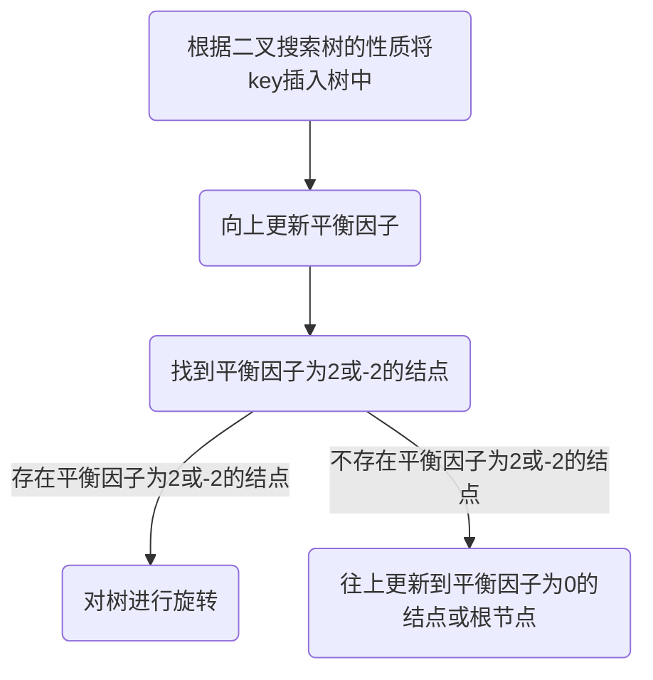

[toc]

# 🌲AVL树

## 🌴什么是AVL树？

在[计算机科学](https://baike.baidu.com/item/计算机科学/9132)中，**AVL树**是最先发明的自平衡二叉查找树。在AVL树中任何节点的两个子树的高度最大差别为1，所以它也被称为**高度平衡树**。增加和删除可能需要通过一次或多次[树旋转](https://baike.baidu.com/item/树旋转)来重新平衡这个树。AVL树得名于它的发明者G. M. Adelson-Velsky和E. M. Landis，他们在1962年的论文《An algorithm for the organization of information》中发表了它。--百度百科

### 🌵要点

- AVL树是二叉搜索树
- AVL在二叉搜索树的基础上加了平衡因子(bf)，**平衡因子=右子树的高度-左子树的高度**，平衡因子用来调节高度，提高二叉搜索树的性能
- AVL平衡因子为-1或0或1，为-2或2时表示不平衡，所以在一棵正确的AVL树中平衡因子的绝对值都小于等于1
- AVL树通过平衡因子调节树高度的方式是树旋转

### 🌵例子

平衡因子为-1


平衡因子为0


平衡因子为1


## 🌴AVL树的结点

三叉链结构，不仅有左右孩子，还有指向父亲的指针。

_bf表示平衡因子。

```c++
struct AVLTreeNode
{
	AVLTreeNode<K, V>* _left;
	AVLTreeNode<K, V>* _right;
	AVLTreeNode<K, V>* _parent;
	pair<K, V>_kv;
	int _bf;//平衡因子

	AVLTreeNode(const pair<K,V>& kv)
		:_left(nullptr)
		,_right(nullptr)
		,_parent(nullptr)
		,_kv(kv)
		,_bf(0)
	{}
};
```

## 🌴AVL树的插入

### 🌵插入过程




#### 🍃代码

> 找位置插入是二叉搜索树的知识，处理平衡因子是重点

- 更新平衡因子，新增结点插入在父节点的左边，父节点平衡因子--
- 更新平衡因子，新增结点插入在父节点的右边，父节点平衡因子++
- [二叉搜索树插入相关知识传送门](https://blog.csdn.net/m0_53005929/article/details/124414105?spm=1001.2014.3001.5502)
- 更新平衡因子的过程中，若更新后的平衡因子变为-1或1，表示需要继续向上更新，若为0，无需更新，也无需旋转，若为-2或2，表示此时这棵树需要旋转

> 平衡因子变为-1或1，说明是从0状态过来的（合格的avl树不会有-2和2，因为出现2和-1就被处理了），说明树的高度变化，需要继续更新。
>
> 平衡因子变为0，说明是从-1或1状态过来的，此时没有改变树的高度，所以无需处理，也不用向上更新
>
> 平衡因子变为2或-2，不符合avl树定义，进行旋转操作使平衡因子减小.

```c++
	bool Insert(const pair<K, V>& kv)
	{
		if (_root == nullptr)
		{
			_root = new Node(kv);
			return true;
		}
		Node* cur = _root;
		Node* cur_parent = nullptr;
		while (cur)
		{
			if (kv.first < (cur->_kv).first)
			{
				cur_parent = cur;
				cur = cur->_left;
			}
			else if (kv.first > (cur->_kv).first)
			{
				cur_parent = cur;
				cur = cur->_right;
			}
			else
			{
				return false;
			}
		}
		cur = new Node(kv);
		if (kv.first < (cur_parent->_kv).first)
		{
			//插在左边
			cur_parent->_left = cur;
			cur->_parent = cur_parent;//三叉链还得注意父亲
		}
		else
		{
			//擦在右间
			cur_parent->_right =cur;
			cur->_parent = cur_parent;
		}

		//处理平衡因子
		while (cur_parent)
		{
			if (cur_parent->_left==cur)
			{
				(cur_parent->_bf)--;
			}
			else
			{
				(cur_parent->_bf)++;
			}
			if (cur_parent->_bf == 0)
			{
				break;
			}
			else if (cur_parent->_bf == 1 || cur_parent->_bf == -1)
			{
				//继续往上调整
				cur = cur_parent;
				cur_parent = cur->_parent;
			}
			else if (cur_parent->_bf == 2 || cur_parent->_bf == -2)
			{
				//为+-2就是不平衡
				if (cur_parent->_bf == -2 && cur->_bf == -1)
				{
					//右旋
					RotateR(cur_parent);
				}
				else if (cur_parent->_bf == 2 && cur->_bf == 1)
				{
					//左旋
					RotateL(cur_parent);
				}
				else if (cur_parent->_bf == -2 && cur->_bf == 1)
				{
					//左右双旋
					RotateLR(cur_parent);

				}
				else if (cur_parent->_bf == 2 && cur->_bf == -1)
				{
					//右左双旋
					RotateRL(cur_parent);
				}
				else
				{
					assert(false);
				}
				break;
			}
			
		}
		return true;
	}
```


#### 🍃例子


**<font size=8,font color=red>注意：下面动图的平衡因子全都是反的，和网站有关，网站的平衡因子是把左子树高度减去右子树高度，所以观看动图时只需注意更新路径和旋转过程</font>**

### 🌵直线or折线

若树需要进行旋转处理，且平衡因子更新轨迹是直线，则单旋（旋转一次）

若树需要进行旋转处理，且平衡因子更新轨迹是折线，则双旋（旋转两次）

所以下面我们先了解平衡因子的更新轨迹

#### 🍃更新平衡因子的轨迹是直线

**<font color=red>插入5为例</font>**


> 这里结点10的bf为-1,20的bf(平衡因子)为-2


#### 🍃更新平衡因子的轨迹是折线

**<font color=blue>插入15为例</font>**


### 🌵树的旋转

#### 🍃左单旋

左旋的意思是以一个结点为中心往左边转

应用场景：直线（平衡因子的更新轨迹），结点的平衡因子为2

翻译：平衡因子的更新轨迹为直线，且有一个结点的右子树比左子树更高，高2。

理解：左旋是往左边转，就是把左边的子树”往下拉“，即让左子树深度变深使得整棵树平衡。

文字过程：

把平衡因子为2的结点记为parent,其右孩子记为subR，右孩子的左孩子记为subRL,parent往下移，subR往上移，此时subRL无人接管，交给parent接管，**再更新平衡因子**。~~这个图要自己画不然很难理解~~


##### 🥝抽象图


例子


##### 🥝代码实现

- subRL可能为空
- 旋转的中心可能上面还有父亲，即旋转的这棵树可能只是子树
- 旋转中心为根时
- 更新平衡因子
- 更新了指向孩子的指针后别忘了更改指向父亲的指针（三叉链结构）

```c++
	void RotateL(Node* parent)
	{
		Node* subR = parent->_right;
		Node* subRL = subR->_left;
		parent->_right = subRL;
		if (subRL)
		{
			subRL->_parent = parent;
		}
		Node* ppNode = parent->_parent;
		subR->_left = parent;
		parent->_parent = subR;
		if (parent == _root)
		{
			_root = subR;
			subR->_parent = nullptr;
		}
		else
		{
			if (ppNode->_left == parent)
			{
				ppNode->_left = subR;
			}
			else
			{
				ppNode->_right = subR;
			}
			subR->_parent = ppNode;
		}
		subR->_bf = parent->_bf = 0;
	}
```


#### 🍃右单旋

右旋的意思是以一个结点为中心往右边转

应用场景：直线（平衡因子的更新轨迹），结点的平衡因子为-2

翻译：平衡因子的更新轨迹为直线，且有一个结点的左子树比右子树更高，高2。

理解：右旋是往右边转，就是把右边的子树”往下拉“，即让右子树深度变深使得整棵树平衡。

文字过程：

把平衡因子为2的结点记为parent,其左孩子记为subL，左孩子的右孩子记为subLR,parent往下移，subL往上移，此时subLR无人接管，交给parent接管，**再更新平衡因子**。~~这个图要自己画不然很难理解~~


##### 🥝抽象图

 

例子


##### 🥝代码实现

```c++
	void RotateR(Node* parent)
	{
		Node* subL = parent->_left;
		Node* subLR = subL->_right;
		//subLR可能为空
		//subL可能为根节点
		//subL上面还有结点
		//更新平衡因子
        //别忘了更新指向父亲的指针
		parent->_left = subLR;
		if (subLR)
		{
			subLR->_parent = parent;
		}
		Node* ppNode = parent->_parent;
		subL->_right = parent;
		parent->_parent = subL;
		if (parent == _root)
		{
			_root = subL;
			subL->_parent = nullptr;
		}
		else
		{
			if (ppNode->_left == parent)
			{
				ppNode->_left = subL;
			}
			else
			{
				ppNode->_right = subL;
			}
			//十分重要的一点 别忘了更新父亲
			subL->_parent = ppNode;
		}
		subL->_bf = parent->_bf = 0;
	}
```

#### 🍃左右双旋

先左单旋再右单旋

场景：平衡因子更新轨迹为折线，出现平衡因子为-2的结点

原理：轨迹为折线时，一次单旋无法得到正确的结果。需要先单旋把折线转为直线，再进行一次单旋调节高度.

##### 🥝抽象图


##### 🥝代码实现

- 插入的结点在父节点的左边还是右边平衡因子的变化不同，故难点在于平衡因子的更新，具体的更新可以自己画图理解

  

```c++
void RotateLR(Node* parent)
	{
		//针对左子树的折线
		Node* subL = parent->_left;
		Node* subLR = subL->_right;
		int bf = subLR->_bf;	//记录下平衡因子，旋转后平衡因子发生了变化
		RotateL(parent->_left);
		RotateR(parent);

		if (bf == -1)
		{
			parent->_bf = 1;
			subLR->_bf = subL->_bf = 0;
		}
		else if (bf == 1)
		{
			subL->_bf = -1;
			subLR->_bf = parent->_bf = 0;
		}
		else if (bf == 0)
		{
			parent->_bf = 0;
			subL->_bf = subLR->_bf = 0;
		}
		else
		{
			assert(false);
		}
	}
```


#### 🍃右左双旋

先右单旋再左单旋

场景：平衡因子更新轨迹为折线，出现平衡因子为-2的结点

原理：轨迹为折线时，一次单旋无法得到正确的结果。需要先单旋把折线转为直线，再进行一次单旋调节高度

##### 🥝抽象图


##### 🥝代码实现

- 插入的结点在父节点的左边还是右边平衡因子的变化不同，故难点在于平衡因子的更新，具体的更新可以自己画图理解


```c++
void RotateRL(Node* parent)
	{
		//针对右子树的折线
		Node* subR = parent->_right;
		Node* subRL = subR->_left;
		int bf = subRL->_bf;
		RotateR(parent->_right);
		RotateL(parent);
		if (bf == -1)
		{
			subR->_bf = 1;
			parent->_bf = subRL->_bf = 0;
		}
		else if (bf == 1)
		{
			parent->_bf = -1;
			subR->_bf = subRL->_bf = 0;
		}
		else if (bf == 0)//有三个节点时的特殊情况
		{
			subR->_bf = 0;
			subRL->_bf = 0;
			parent->_bf = 0;
		}
		else
		{
			assert(false);
		}	
	}
```

> 其实看完两个抽象图可以知道，双旋就是把两个高度为h-1的子树给了parent和子树的父节点的父节点

## 🌴检验是否是AVL树

检验标准

- 左右子树的高度差的绝对值是不是小于2？
- 右子树高度-左子树高度会不会等于根节点的平衡因子？
- 左右子树是不是avl树？

> 三个条件都满足时才是合格的avl树

### 🌵代码实现

```c++
	int _Height(Node* root)
	{
		if (root == nullptr)
		{
			return 0;
		}
		int LHeight = _Height(root->_left) ;
		int RHeight = _Height(root->_right) ;
		return ((LHeight > RHeight) ? LHeight+1 : RHeight+1) ;
	}

	bool IsBalance()
	{
		
		return _IsBalance(_root);
	}
	bool _IsBalance(Node* root)
	{
		if (root == nullptr)
		{
			return true;
		}
		int LHeight = Height(root->_left);
		int RHeight = Height(root->_right);
		if (root->_bf != (RHeight - LHeight))
		{
			cout << "平衡因子失常" << endl;
			return false;
		}
		return abs(LHeight - RHeight) < 2
			&& _IsBalance(root->_left)
			&& _IsBalance(root->_right);	
	}
```

## 🌴总结

- AVL树在二叉搜索树的基础上增加了平衡因子来控制树的高度，进而提高了查找效率，查找的时间复杂度（logn)
- 如果对AVL树进行删除修改等操作，可能旋转多次，效率较低，所以AVL树常用于静态的数据（即不会改变），若是存储经常修改的效率，AVL树的效率并不高

- 红黑树的效率在二叉搜索树的基础上增加了红黑两个颜色，也可以控制树的高度，此外红黑树的效率比AVL树更高，因为红黑树在构建时不需要像AVL树多次旋转

[(AVL树代码汇总--github链接)](https://github.com/CCLCK/Database-Structure/blob/main/AVL-Tree/AVLTree.h))

