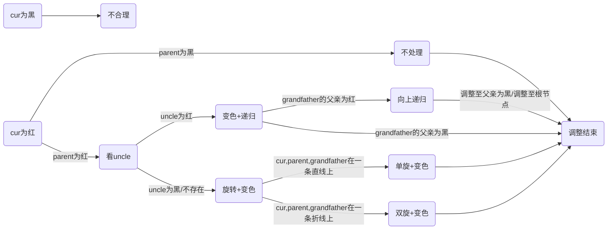

# 红黑树

> 学红黑树之前默认你已经熟悉了二叉搜索树和AVL树

## 概念

### 什么是红黑树？

>红黑树（Red Black Tree） 是一种自平衡二叉查找树，是在[计算机](https://baike.baidu.com/item/计算机)科学中用到的一种[数据结构](https://baike.baidu.com/item/数据结构/1450)，典型的用途是实现[关联数组](https://baike.baidu.com/item/关联数组/3317025)。 [1] 
>
>红黑树是在1972年由[Rudolf Bayer](https://baike.baidu.com/item/Rudolf Bayer/3014716)发明的，当时被称为平衡二叉B树（symmetric binary B-trees）。后来，在1978年被 Leo J. Guibas 和 Robert Sedgewick 修改为如今的“红黑树”。 [2] 
>
>红黑树是一种特化的AVL树（[平衡二叉树](https://baike.baidu.com/item/平衡二叉树/10421057)），都是在进行插入和删除操作时通过特定操作保持二叉查找树的平衡，从而获得较高的查找性能。 [2] 
>
>它虽然是复杂的，但它的最坏情况运行时间也是非常良好的，并且在实践中是高效的： 它可以在O(log n)时间内做查找，插入和删除，这里的n 是树中元素的数目。 [2] -- 百度百科

简单来说，在二叉搜索树的基础上加了红黑两种颜色，通过颜色的调控可以控制树的高度，由此提高了查找效率。

> 二叉搜索树的缺陷在于在最坏情况下查找的效率是O(N)，这一点都不优雅😳，而红黑树解决了这个问题，最坏的情况下红黑树的查找效率依旧是O(logn)！

### 红黑树的性质

1. 每个结点颜色不是红色就是黑色
2. 根节点是黑色
3. 如果一个结点是红色，则它的两个孩子结点必为黑（即一条路径上不会有两个连续的红）
4. 每个结点，从该节点到叶子结点的简单路径上，均包含相同数目的黑色结点
5. 每个叶子结点都是黑色的（此处的叶子是空结点）

**<font color= #1E90FF>思考下面的问题</font>**

- 第三条和第四条性质为什么可以推出最长路径会小于等于最短路径的两倍？

因为理论上红黑树中最短路径全黑，最长路径两个黑之间夹一个红


> 正因为最长路径<=2*最短路径，由此就控制了树的高度，也说明红黑树不像AVL树那样严格平衡，其实可以通过计算可知AVL树的具体查找效率是logn,红黑树的具体查找效率是2logn，logn和2logn的效率相差不大。假设数据规模n为十亿，logn也就等于30左右，2logn也就是60,对于现在的CPU来说基本上没啥差别，但是构造红黑树的代价（旋转次数）却会比构造AVL树低很多，由此我们可知红黑树的效率其实是比AVL树高的。

- 第五条性质说的是什么意思？


- 红色结点的孩子必定是黑色结点，确保了红黑相间，所以可以有连续黑，但不可能有连续红


## 插入

### 铺垫

- 红黑树是在二叉搜索树的基础上，由二叉搜索树的知识可知插入的位置肯定是在空节点的位置（也就是的在叶子的下一个位置）

- 新增节点的颜色为什么是红色？

假如把新增节点的颜色设置为黑色，那会导致每条路径的黑色结点数目不同（性质4），调整起来代价很大，如果把新增结点设为红色，就好处理很多，因为插入红色结点只需考虑不要出现连续的红色结点（性质三）。

> 理论上把新增结点设为黑色也可以调整，但是效率肯定会比红色更低。~~因为在红黑树的删除中，最麻烦的就是删除后每条路径的黑色结点数不同~~

- 记住下面各个结点的表示符号


> grandfather仅仅是一颗子树的根，不一定是整棵树的根

### 插入的各种情况




1. **<font color= #40E0D0>parent为黑,uncle和grandfather随意</font>**

**处理**：不做处理。可知插入新增结点仍然是一棵合格的红黑树

下面列出parent为黑时的各种情况


2. **<font color= #40E0D0>parent为红色结点，grandfather为黑，uncle未定</font>**

> parent为红，grandparent必为黑(红黑相间的性质)，此时的处理取决于uncle
>
> 本质上就是在处理双红(连续的红结点)的情况

2.1 uncle为红

处理：parent和uncle变黑，grandparent变红，再把cur指针指向grandparent向上递归处理

**抽象图**


**具体图**


> 随笔记录：此时只需要变色不需要旋转（下面p表示parent，u表示uncle，g表示grandfather）
>
> p和u都处理为黑，g处理为红  这条路径本来就是一黑 ，处理后依旧是一黑，若是g处理为红后，**g的父亲也是红，则仍然存在两个连续的红，则继续处理**
>

2.2 uncle为黑/不存在

> **<font color=red>这种情况肯定不是初状态，是由情况2.1变来的</font>**
>
> 原因：
>
> 中间状态可能是情况2.1向上递归出现的其中一种情况

2.2.1 grandfather、parent、cur在一条直线上

处理：单旋+变色


<font color=red>**抽象图**</font>：[高清图片](https://pic-1304888003.cos.ap-guangzhou.myqcloud.com/img/image-20220504222653793.png)

**<font color= #40E0D0>第一步：单旋</font>**


**<font color= #40E0D0>第二步：变色</font>**


> 这是新增结点在左子树的情况，那在右子树呢？可以自己尝试画图实现

2.2.2 grandfather、parent、cur在一条折线上

处理：双旋+变色


<font color=red>**抽象图**</font>(假设cur在grandfather的左子树)

**<font color= #40E0D0>第一步：以parent为轴左旋</font>**


**<font color= #40E0D0>第二步：以grandfather为轴右旋</font>**


**<font color= #40E0D0>第三步：变色</font>**


> 这是cur在grandfatehr的左子树且为折线的情况，可以自己尝试画出cur在右子树且为折线的状态
>
> 随笔记录：
>
> 如何处理？旋转+变色 ；p一定要从红变为黑； g为黑，u为黑转到下面去,再把p由红转黑，g和u转到下面去后黑色结点数目本来是没变的，但是因为p是祖父变色了，影响了这棵子树，就得把u由黑转红实现红黑树的平衡
>
> 第二种情况可以直接break了，第二种情况旋转变色完cur出现在最上面为黑色，不必继续更新。
>
> 其中uncle不存在，就当做为空去写，因为rotateR和rotateL已经对uncle为空进行了处理，所以代码实现时不会出现空指针解引用的情况

### 代码实现

#### 红黑树结点

- 枚举体保证性质一 一定成立
- 三叉链结构，和二叉搜索树一样
- 插入的是KV键值对，根据K值排序
- 析构函数防止内存泄漏（删除过程中有用）

```c++
enum Color
{
	RED,
	BLACK
};
template<class K,class V>
struct RBTreeNode
{
	RBTreeNode* _left;
	RBTreeNode* _right;
	RBTreeNode* _parent;

	pair<K, V>_kv;
	int _col;

	RBTreeNode(const pair<K,V>&kv)
		:_left(nullptr)
		,_right(nullptr)
		,_parent(nullptr)
		,_kv(kv)
		,_col(RED)
	{}
	~RBTreeNode()
	{
		_left = nullptr;
		_right = nullptr;
		_parent = nullptr;
		_col = BLACK;
	}
};
```

#### 插入代码

```c++
template<class K,class V>
class RBTree
{
	typedef RBTreeNode<K,V> Node;
public:
	RBTree()
		:_root(nullptr)
	{}
    
	bool Insert(const pair<K, V>& kv)
	{
		if (_root == nullptr)
		{
			_root = new Node(kv);
			_root->_col = BLACK;
			return true;
		}
		Node* cur = _root;
		Node* parent = nullptr;
		while (cur)
		{
			if (kv.first < (cur->_kv).first)
			{
				parent = cur;
				cur = cur->_left;
			}
			else if (kv.first > (cur->_kv).first)
			{
				parent = cur;
				cur = cur->_right;
			}
			else//存在相同值
			{
				return false;
			}
		}
		cur = new Node(kv);
		if ((cur->_kv).first < (parent->_kv).first)
		{
			parent->_left = cur;
		}
		else
		{
			parent->_right = cur;
		}
		cur->_parent = parent;

		//开始处理红黑因子
		while (parent && parent->_col == RED)
		{
			_root->_col = BLACK;
			Node* grandfather = parent->_parent;
			if (parent == grandfather->_left)//父亲是左孩子 为了判断是直线还是折线  一共有四种可能
			{
				Node* uncle = grandfather->_right;
				if (uncle && uncle->_col == RED)//uncle存在且为红
				{
					grandfather->_col = RED;
					parent->_col = uncle->_col = BLACK;
					cur = grandfather;
					parent = cur->_parent;
				}
				else //uncle不存在或者uncle为黑
				{
					if (parent->_left == cur)//直线
					{
						RotateR(grandfather);
						parent->_col = BLACK;
						grandfather->_col = RED;
					}
					else//折线
					{
						RotateL(parent);
						RotateR(grandfather);
						grandfather->_col = RED;
						cur->_col = BLACK;
					}
					break;
				}
			}
			else//父亲是右孩子
			{
				Node* uncle = grandfather->_left;
				if (uncle && uncle->_col == RED)
				{
					parent->_col = uncle->_col = BLACK;
					grandfather->_col = RED;
					cur = grandfather;
					parent = cur->_parent;//迭代
				}
				else//uncle不存在或uncle为黑
				{
					if (parent->_right == cur)
					{
						RotateL(grandfather);
						parent->_col = BLACK;
						grandfather->_col = RED;
					}
					else//折线
					{
						RotateR(parent);
						RotateL(grandfather);
						cur->_col = BLACK;
						grandfather->_col = RED;
					}
					break;
				}
			}
		}
		_root->_col = BLACK;
		return true;
	}

	void RotateR(Node* parent)//右旋
	{
        //subLR是否存在
        //parent为根时
        //parent上面还有结点时
        //更新subL的父亲
		Node* subL = parent->_left;
		Node* subLR = subL->_right;
		parent->_left = subLR;
		if (subLR)
		{
			subLR->_parent = parent;
		}
		Node* ppNode = parent->_parent;
		subL->_right = parent;//subL不可能为空 旋转时平衡因子肯定为2或-2 即该节点往下一层一定存在
		parent->_parent = subL;
		if(parent == _root)
		{
			_root = subL;
			subL->_parent = nullptr;
		}
		else
		{
			if (ppNode->_left == parent)
			{
				ppNode->_left = subL;
			}
			else
			{
				ppNode->_right = subL;
			}
			subL->_parent = ppNode;
		}
		
	}
	void RotateL(Node* parent)//左旋
	{
		Node* subR = parent->_right;
		Node* subRL = subR->_left;
		parent->_right = subRL;
		if (subRL)
		{
			subRL->_parent = parent;
		}
		Node* ppNode = parent->_parent;
		subR->_left = parent;
		parent->_parent = subR;
		if (parent == _root)
		{
			_root = subR;
			subR->_parent = nullptr;
		}
		else
		{
			if (ppNode->_left == parent)
			{
				ppNode->_left = subR;
			}
			else
			{
				ppNode->_right = subR;
			}
			subR->_parent = ppNode;
		}
		
	}
    private:
	Node* _root;
};
```

### 判断是否是红黑树

思路：根据五条性质来判断

1. 每个结点颜色不是红色就是黑色

   <font color=green>枚举体确定</font>

2. 根节点是黑色

   <font color=green>条件判断即可</font>

3. 如果一个结点是红色，则它的两个孩子结点必为黑（即一条路径上不会有两个连续的红）

   <font color=green>判断是否有连续红，借助parent指针直接找到父亲</font>

   > 父亲为红，孩子可能不存在，不好判断是否有连续红，但是每个孩子都只有一个父亲，所以如果孩子为红，判断其父亲是否为红即可判断是否具有连续红结点，找父亲借助parent指针

   ```c++
   	bool CheckRED(Node* root)
   	{
   		if (root == nullptr)
   		{
   			return true;
   		}
   		//孩子不一定存在，所以检查红色结点的父亲是否为红
   		if (root->_col == RED)
   		{
   			if ((root->_parent)->_col == RED)
   			{
   				cout << "连续的红色结点" << endl;
   				return false;
   			} 
   			//这里不能直接return  true 因为还要检查这个结点的子树是否存在连续的红结点
   		}
   		return CheckRED(root->_left)
   			&& CheckRED(root->_right);
   
   	}
   ```

   

4. 每个结点，从该节点到叶子结点的简单路径上，均包含相同数目的黑色结点

   <font color=green>记录随便一条路径的黑色结点作为基准值，每条路径的黑色结点和基准值去做比较</font>

   ```c++
   
   	bool CheckBlackNums(Node* root,int blackNums,int benchmark)
   	{
           //blackNums表示从根节点到当前节点的路径有几个黑色结点
   		if (root == nullptr)
   		{
   			if (blackNums == benchmark)
   			{
   				return true;
   			}
   			else
   			{
   				cout << "每条路径上黑色节点不一样" << endl;
   				return false;
   			}		
   		}
   		if (root->_col == BLACK)
   		{
   			blackNums++;
   		}
   		return CheckBlackNums(root->_left,blackNums,benchmark) && CheckBlackNums(root->_right, blackNums, benchmark);
   
   	}
   ```

   

5. 每个叶子结点都是黑色的（此处的叶子是空结点）

   <font color=green>不必判断</font>

**代码调用**

```c++

	bool IsBalance()
	{
		if (_root == nullptr)
		{
			return true;
		}
		if (_root->_col == RED)
		{
			cout << "根节点为红色" << endl;
			return false;
		}
		int benchmark = 0;
		Node* cur = _root;
		while (cur)
		{
			if (cur->_col == BLACK)
			{
				benchmark++;//算基准值
			}
			cur = cur->_left;
		}
		int blacknum = 0;
		return CheckRED(_root)
			&& CheckBlackNums(_root, blacknum, benchmark);
	}
```

## 删除


## 总结


走到空表示是一条路径，然后算出的黑色结点的个数和基准值去比较，相同返回true,否则返回false

红色节点的孩子一定得是黑的，但是孩子不一定存在，不如去去检查红色结点的父亲一定是黑的，不如就存在连续的红，不符合红黑树定义


给出一系列的随机值去进行测试


旋转本质上就只是改变了树的形状，并没有改变树的性质（二叉搜索树）

合理的旋转可以达到降低树的高度，又因本身不改变树的性质，所以合理的旋转可以降低树的高度（avl树）


红变黑==增加一个黑色结点

黑变红==考虑是否会出现连续的二红


不管是单旋还是双旋，grandfather都被转到下面去了，颜色都被置为红色，把旋转后的根置为黑色.

> ~~感觉上，根节点置为黑色更好控制平衡，多画几个图会有这种感觉...~~


> 红黑树的删除代码写了两天，测试代码晚上十二点半过了（忘了传昨天的github😭），成就感拉满！--记录于2022/5/4/00:30