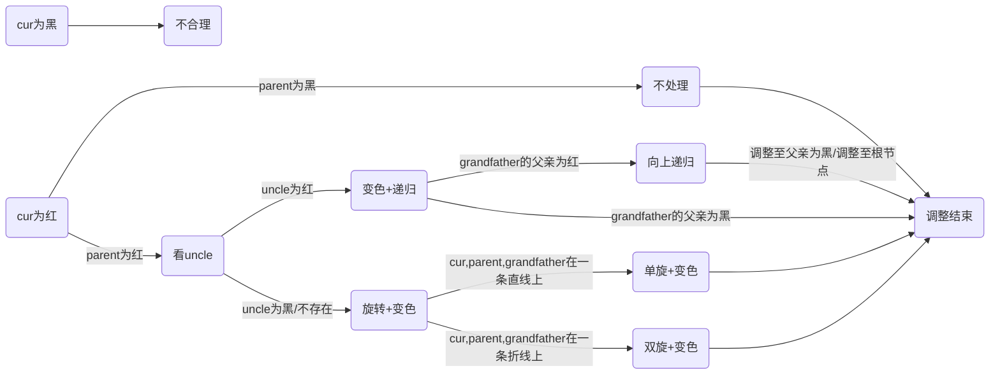
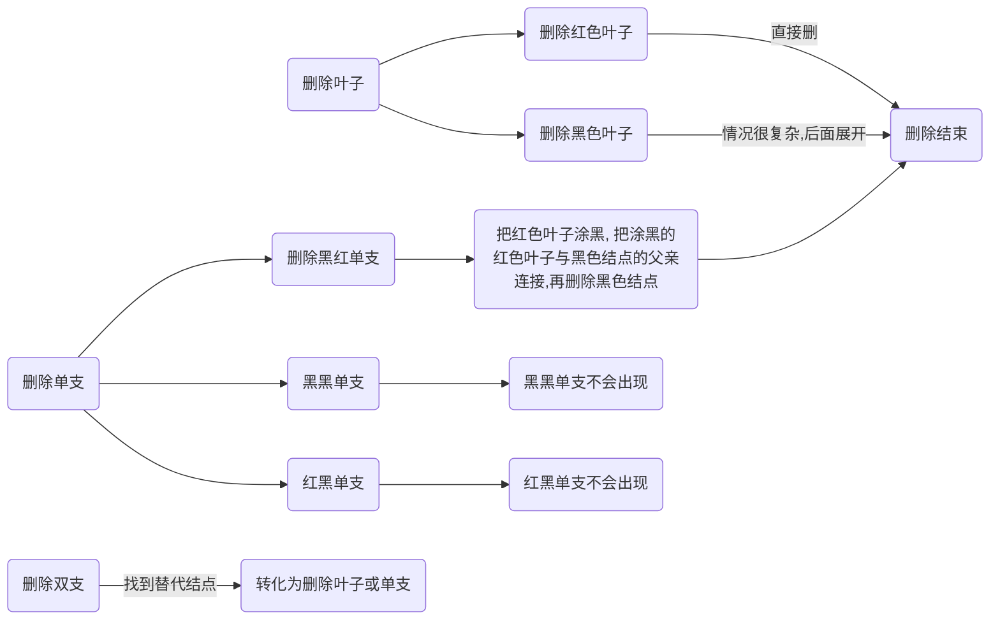
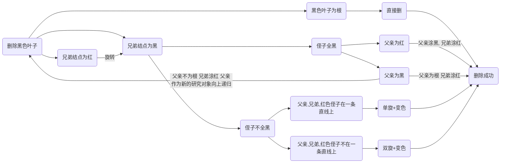

[toc]

# 🌲红黑树

> 学红黑树之前默认你已经熟悉了二叉搜索树和AVL树
>
> 

## 🌴概念

### 🌵什么是红黑树？

>红黑树（Red Black Tree） 是一种自平衡二叉查找树，是在[计算机](https://baike.baidu.com/item/计算机)科学中用到的一种[数据结构](https://baike.baidu.com/item/数据结构/1450)，典型的用途是实现[关联数组](https://baike.baidu.com/item/关联数组/3317025)。 [1] 
>
>红黑树是在1972年由[Rudolf Bayer](https://baike.baidu.com/item/Rudolf Bayer/3014716)发明的，当时被称为平衡二叉B树（symmetric binary B-trees）。后来，在1978年被 Leo J. Guibas 和 Robert Sedgewick 修改为如今的“红黑树”。 [2] 
>
>红黑树是一种特化的AVL树（[平衡二叉树](https://baike.baidu.com/item/平衡二叉树/10421057)），都是在进行插入和删除操作时通过特定操作保持二叉查找树的平衡，从而获得较高的查找性能。 [2] 
>
>它虽然是复杂的，但它的最坏情况运行时间也是非常良好的，并且在实践中是高效的： 它可以在O(log n)时间内做查找，插入和删除，这里的n 是树中元素的数目。 [2] -- 百度百科

简单来说，在二叉搜索树的基础上加了红黑两种颜色，通过颜色的调控可以控制树的高度，由此提高了查找效率。

> 二叉搜索树的缺陷在于在最坏情况下查找的效率是O(N)，这一点都不优雅😳，而红黑树解决了这个问题，最坏的情况下红黑树的查找效率依旧是O(logn)！

### 🌵红黑树的性质

1. 每个结点颜色不是红色就是黑色
2. 根节点是黑色
3. 如果一个结点是红色，则它的两个孩子结点必为黑（即一条路径上不会有两个连续的红）
4. 每个结点，从该节点到叶子结点的简单路径上，均包含相同数目的黑色结点
5. 每个叶子结点都是黑色的（此处的叶子是指空结点）

**<font color= #1E90FF>思考下面的问题</font>**

- 第三条和第四条性质为什么可以推出最长路径会小于等于最短路径的两倍？

因为理论上红黑树中最短路径全黑，最长路径两个黑之间夹一个红


> 正因为最长路径<=2*最短路径，由此就控制了树的高度，也说明红黑树不像AVL树那样严格平衡，其实可以通过计算可知AVL树的具体查找效率是logn,红黑树的具体查找效率是2logn，logn和2logn的效率相差不大。假设数据规模n为十亿，logn也就等于30左右，2logn也就是60,对于现在的CPU来说基本上没啥差别，但是构造红黑树的代价（旋转次数）却会比构造AVL树低很多，由此我们可知红黑树的效率其实是比AVL树高的。

- 第五条性质说的是什么意思？


- 红色结点的孩子必定是黑色结点，确保了红黑相间，所以可以有连续黑，但不可能有连续红


## 🌴插入

### 🌵铺垫

- 红黑树是在二叉搜索树的基础上，由二叉搜索树的知识可知插入的位置肯定是在空节点的位置（也就是的在叶子的下一个位置）

- 新增节点的颜色为什么是红色？

假如把新增节点的颜色设置为黑色，那会导致每条路径的黑色结点数目不同（性质4），调整起来代价很大，如果把新增结点设为红色，就好处理很多，因为插入红色结点只需考虑不要出现连续的红色结点（性质三）。

> 理论上把新增结点设为黑色也可以调整，但是效率肯定会比红色更低。~~因为在红黑树的删除中，最麻烦的就是删除后每条路径的黑色结点数不同~~

- 记住下面各个结点的表示符号


> grandfather仅仅是一颗子树的根，不一定是整棵树的根

- 我个人把一棵**合格的**红黑树旋转前的状态成为初状态/初态（这个是我编的，为了后面更好描述🤪）

### 🌵插入的各种情况

[流程图高清图片](https://pic-1304888003.cos.ap-guangzhou.myqcloud.com/img/image-20220505150554662.png)




1. **<font color= #40E0D0>parent为黑,uncle和grandfather随意</font>**

**处理**：不做处理。可知插入新增结点仍然是一棵合格的红黑树

下面列出parent为黑时的各种情况


2. **<font color= #40E0D0>parent为红色结点，grandfather为黑，uncle未定</font>**

> parent为红，grandparent必为黑(红黑相间的性质)，此时的处理取决于uncle
>
> 本质上就是在处理双红(连续的红结点)的情况

2.1 uncle为红

处理：parent和uncle变黑，grandparent变红，再把cur指针指向grandparent向上递归处理

**抽象图**


**具体图**


> 随笔记录：此时只需要变色不需要旋转（下面p表示parent，u表示uncle，g表示grandfather）
>
> p和u都处理为黑，g处理为红  这条路径本来就是一黑 ，处理后依旧是一黑，若是g处理为红后，**g的父亲也是红，则仍然存在两个连续的红，则继续处理**
>
> 红变黑==增加一个黑色结点
>
> 黑变红==减少一个黑色结点，考虑是否会出现连续的二红

2.2 uncle为黑/不存在

> **<font color=red>这种情况肯定不是初状态，是由情况2.1变来的</font>**
>
> 原因：
>
> 中间状态可能是情况2.1向上递归出现的其中一种情况

2.2.1 grandfather、parent、cur在一条直线上

处理：单旋+变色


<font color=red>**抽象图**</font>：[高清图片](https://pic-1304888003.cos.ap-guangzhou.myqcloud.com/img/image-20220504222653793.png)

**<font color= #40E0D0>第一步：单旋</font>**


**<font color= #40E0D0>第二步：变色</font>**


> 这是新增结点在左子树的情况，那在右子树呢？可以自己尝试画图实现

2.2.2 grandfather、parent、cur在一条折线上

处理：双旋+变色


<font color=red>**抽象图**</font>(假设cur在grandfather的左子树)

**<font color= #40E0D0>第一步：以parent为轴左旋</font>**


**<font color= #40E0D0>第二步：以grandfather为轴右旋</font>**


**<font color= #40E0D0>第三步：变色</font>**


> 这是cur在grandfatehr的左子树且为折线的情况，可以自己尝试画出cur在右子树且为折线的状态
>
> 随笔记录：
>
> - 如何处理？旋转+变色 ；p一定要从红变为黑； g为黑，u为黑转到下面去,再把p由红转黑，g和u转到下面去后黑色结点数目本来是没变的，但是因为p是祖父变色了，影响了这棵子树，就得把u由黑转红实现红黑树的平衡
>
> - 第二种情况可以直接break了，第二种情况旋转变色完cur出现在最上面为黑色，不必继续更新。
>
> - 其中uncle不存在，就当做为空去写，因为rotateR和rotateL已经对uncle为空进行了处理，所以代码实现时不会出现空指针解引用的情况
>
> - 不管是单旋还是双旋，grandfather都被转到下面去了，颜色都被置为红色，再把旋转后的根置为黑色.
>
> ~~感觉上，根节点置为黑色更好控制平衡，多画几个图会有这种感觉...~~


### 🌵红黑树结点

- 枚举体保证性质一 一定成立
- 三叉链结构，和二叉搜索树一样
- 插入的是KV键值对，根据K值排序
- 析构函数防止内存泄漏（删除过程中有用）

```c++
enum Color
{
	RED,
	BLACK
};
template<class K,class V>
struct RBTreeNode
{
	RBTreeNode* _left;
	RBTreeNode* _right;
	RBTreeNode* _parent;

	pair<K, V>_kv;
	int _col;

	RBTreeNode(const pair<K,V>&kv)
		:_left(nullptr)
		,_right(nullptr)
		,_parent(nullptr)
		,_kv(kv)
		,_col(RED)
	{}
	~RBTreeNode()
	{
		_left = nullptr;
		_right = nullptr;
		_parent = nullptr;
		_col = BLACK;
	}
};
```

### 🌵代码实现

```c++
template<class K,class V>
class RBTree
{
	typedef RBTreeNode<K,V> Node;
public:
	RBTree()
		:_root(nullptr)
	{}
    
	bool Insert(const pair<K, V>& kv)
	{
		if (_root == nullptr)
		{
			_root = new Node(kv);
			_root->_col = BLACK;
			return true;
		}
		Node* cur = _root;
		Node* parent = nullptr;
		while (cur)
		{
			if (kv.first < (cur->_kv).first)
			{
				parent = cur;
				cur = cur->_left;
			}
			else if (kv.first > (cur->_kv).first)
			{
				parent = cur;
				cur = cur->_right;
			}
			else//存在相同值
			{
				return false;
			}
		}
		cur = new Node(kv);
		if ((cur->_kv).first < (parent->_kv).first)
		{
			parent->_left = cur;
		}
		else
		{
			parent->_right = cur;
		}
		cur->_parent = parent;

		//开始处理红黑因子
		while (parent && parent->_col == RED)
		{
			_root->_col = BLACK;
			Node* grandfather = parent->_parent;
			if (parent == grandfather->_left)//父亲是左孩子 为了判断是直线还是折线  一共有四种可能
			{
				Node* uncle = grandfather->_right;
				if (uncle && uncle->_col == RED)//uncle存在且为红
				{
					grandfather->_col = RED;
					parent->_col = uncle->_col = BLACK;
					cur = grandfather;
					parent = cur->_parent;
				}
				else //uncle不存在或者uncle为黑
				{
					if (parent->_left == cur)//直线
					{
						RotateR(grandfather);
						parent->_col = BLACK;
						grandfather->_col = RED;
					}
					else//折线
					{
						RotateL(parent);
						RotateR(grandfather);
						grandfather->_col = RED;
						cur->_col = BLACK;
					}
					break;
				}
			}
			else//父亲是右孩子
			{
				Node* uncle = grandfather->_left;
				if (uncle && uncle->_col == RED)
				{
					parent->_col = uncle->_col = BLACK;
					grandfather->_col = RED;
					cur = grandfather;
					parent = cur->_parent;//迭代
				}
				else//uncle不存在或uncle为黑
				{
					if (parent->_right == cur)
					{
						RotateL(grandfather);
						parent->_col = BLACK;
						grandfather->_col = RED;
					}
					else//折线
					{
						RotateR(parent);
						RotateL(grandfather);
						cur->_col = BLACK;
						grandfather->_col = RED;
					}
					break;
				}
			}
		}
		_root->_col = BLACK;
		return true;
	}

	void RotateR(Node* parent)//右旋
	{
        //subLR是否存在
        //parent为根时
        //parent上面还有结点时
        //更新subL的父亲
		Node* subL = parent->_left;
		Node* subLR = subL->_right;
		parent->_left = subLR;
		if (subLR)
		{
			subLR->_parent = parent;
		}
		Node* ppNode = parent->_parent;
		subL->_right = parent;//subL不可能为空 旋转时平衡因子肯定为2或-2 即该节点往下一层一定存在
		parent->_parent = subL;
		if(parent == _root)
		{
			_root = subL;
			subL->_parent = nullptr;
		}
		else
		{
			if (ppNode->_left == parent)
			{
				ppNode->_left = subL;
			}
			else
			{
				ppNode->_right = subL;
			}
			subL->_parent = ppNode;
		}
		
	}
	void RotateL(Node* parent)//左旋
	{
		Node* subR = parent->_right;
		Node* subRL = subR->_left;
		parent->_right = subRL;
		if (subRL)
		{
			subRL->_parent = parent;
		}
		Node* ppNode = parent->_parent;
		subR->_left = parent;
		parent->_parent = subR;
		if (parent == _root)
		{
			_root = subR;
			subR->_parent = nullptr;
		}
		else
		{
			if (ppNode->_left == parent)
			{
				ppNode->_left = subR;
			}
			else
			{
				ppNode->_right = subR;
			}
			subR->_parent = ppNode;
		}
		
	}
    private:
	Node* _root;
};
```

### 🌵判断是否是红黑树

思路：根据五条性质来判断

1. 每个结点颜色不是红色就是黑色

   <font color=green>枚举体确定</font>

2. 根节点是黑色

   <font color=green>条件判断即可</font>

3. 如果一个结点是红色，则它的两个孩子结点必为黑（即一条路径上不会有两个连续的红）

   <font color=green>判断是否有连续红，借助parent指针直接找到父亲</font>

   > 父亲为红，孩子可能不存在，不好判断是否有连续红，但是每个孩子都只有一个父亲，所以如果孩子为红，判断其父亲是否为红即可判断是否具有连续红结点，找父亲借助parent指针

   ```c++
   	bool CheckRED(Node* root)
   	{
   		if (root == nullptr)
   		{
   			return true;
   		}
   		//孩子不一定存在，所以检查红色结点的父亲是否为红
   		if (root->_col == RED)
   		{
   			if ((root->_parent)->_col == RED)
   			{
   				cout << "连续的红色结点" << endl;
   				return false;
   			} 
   			//这里不能直接return  true 因为还要检查这个结点的子树是否存在连续的红结点
   		}
   		return CheckRED(root->_left)
   			&& CheckRED(root->_right);
   
   	}
   ```

   

4. 每个结点，从该节点到叶子结点的简单路径上，均包含相同数目的黑色结点

   <font color=green>记录随便一条路径的黑色结点作为基准值，每条路径的黑色结点和基准值去做比较</font>

   ```c++
   
   	bool CheckBlackNums(Node* root,int blackNums,int benchmark)
   	{
           //blackNums表示从根节点到当前节点的路径有几个黑色结点
   		if (root == nullptr)
   		{
   			if (blackNums == benchmark)
   			{
   				return true;
   			}
   			else
   			{
   				cout << "每条路径上黑色节点不一样" << endl;
   				return false;
   			}		
   		}
   		if (root->_col == BLACK)
   		{
   			blackNums++;
   		}
   		return CheckBlackNums(root->_left,blackNums,benchmark) && CheckBlackNums(root->_right, blackNums, benchmark);
   
   	}
   ```

   > 走到空表示是一条路径，然后算出的黑色结点的个数和基准值去比较，相同返回true,否则返回false

5. 每个叶子结点都是黑色的（此处的叶子是空结点）

   <font color=green>不必判断</font>

**代码调用**

```c++

	bool IsBalance()
	{
		if (_root == nullptr)
		{
			return true;
		}
		if (_root->_col == RED)
		{
			cout << "根节点为红色" << endl;
			return false;
		}
		int benchmark = 0;
		Node* cur = _root;
		while (cur)
		{
			if (cur->_col == BLACK)
			{
				benchmark++;//算基准值
			}
			cur = cur->_left;
		}
		int blacknum = 0;
		return CheckRED(_root)
			&& CheckBlackNums(_root, blacknum, benchmark);
	}
```

### 🌵测试代码

生成一系列随机值进行测试


```c++
void test1()//插入测试
{
	RBTree<int,int> rb;
	//rb.Insert(make_pair(4, 1));
	//rb.Insert(make_pair(2, 2));
	//rb.Insert(make_pair(6, 3));
	//rb.Insert(make_pair(1, 4));
	//rb.Insert(make_pair(3, 5));
	//rb.Insert(make_pair(5, 6));
	//rb.Insert(make_pair(15, 7));
	//rb.Insert(make_pair(7, 8));
	//rb.Insert(make_pair(16, 9));
	//rb.Insert(make_pair(14, 10));
	rb.Insert(make_pair(27, 1));
	rb.Insert(make_pair(4, 1));
	rb.Insert(make_pair(12, 1));
	rb.Insert(make_pair(66, 1));
	rb.Insert(make_pair(95, 1));
	rb.Insert(make_pair(82, 1));
	rb.Insert(make_pair(56, 1));
	rb.Insert(make_pair(59, 1));
	rb.Insert(make_pair(73, 1));
	rb.Insert(make_pair(19, 1));

	rb.InOrder();
	cout << rb.IsBalance() << endl;
}
void test2()//插入随机用例测试
{
	RBTree<int, int> rb;
	const int n = 1000000;
	vector<int>v;
	v.reserve(n);
	srand(time(0));
	for (int i = 0; i < n; i++)
	{
		v.push_back(rand());
	}
	for (auto e : v)
	{	
		rb.Insert(make_pair(e, e));
	}
	cout << rb.IsBalance() << endl;
}

```


## 🌴删除

> 红黑树的删除代码写了两天，测试代码晚上十二点半过了（忘了传昨天的github😭），成就感拉满！--记录于2022/5/4/00:30
>
> 跟着这个大佬的思路实现的👉[红黑树-结点的删除（C语言实现） - Wonkey - 博客园 ](https://www.cnblogs.com/wubug/p/13853382.html#:~:text=红黑树的删除终究是围绕二叉查找树的删除为基础，在其上增加了颜色和红黑树的性质，限制了红黑树删除结点后需要做出相应的调整，以满足删除结点后不改变红黑树。,红黑树的删除： (1)删除叶子结点(无论哪种情况，我们最终处理的就是删除叶子结点的过程，2%2C3情况最后还是转化为删除叶子结点))

### 🌵铺垫

**<font color=RED>注：下面提到的黑色叶子不包含NIL结点</font>**

类比二叉搜索树的删除，删除分为删除叶子，删除只有一个孩子的结点，删除有左右孩子的结点。

为空(不存在)的结点统一看做黑色结点，代码实现上如果要用到NIL结点就new一个黑色的临时结点。

**<font size=5><font color= #48D1CC>下面图中的黑色结点不包括NIL结点</font></font>**


[流程图高清图片](https://pic-1304888003.cos.ap-guangzhou.myqcloud.com/img/image-20220505150508476.png)



> - 看到上面的图会发现，只要搞定了删除黑色叶子就大功告成了。这也确确实实是最麻烦的一步，**删除黑色叶子**直接导致这条路径黑色结点数减1，所以我们要想方设法**<font color =#40E0D0>在这条路径上加上一个黑色结点，或者直接把所有路径都减少一个黑色结点，再往上递归处理</font>**
>
> > 减少一个黑色结点为什么需要往上递归？我们对红黑树操作的原因：这条路径少了一个黑色结点。当我们操作这棵子树后使得经过这棵子树的所有路径的黑色结点数都减1，为了使得**整棵树平衡**，自然就以这棵子树的根进行递归，**递归出口**：递归到根（让整棵树所有路径黑色结点减1）或者在这些路径前加上一个黑色结点使得整棵树平衡（也就是第一种情况）,以下图为例
>
> - **<font color=green>删除黑色叶子需要根据其<font color=#40E0D0>兄弟和侄子的情况</font>来进行相对应的判断</font>**
>
> - 黑红单支删的就是黑色结点，黑红单支表示的是只有一个孩子且孩子为红的情况
>
> - 上面说的黑黑单支是不可能出现，但是当黑色结点包括NIL结点时，就可能会出现了
>
> 
>
> 
>
> - 删除双支我一般找后继（右子树最小的值/右子树最左边的叶子）作为替代结点，我后面图中画的所有黑色结点都是后继节点，所以默认黑色结点的左子树为空，而右子树不一定为空，当右子树不为空时，删除双支就转化成了删除黑红单支，若右子树为空，则转为了删除黑色叶子
> - 记一下下面那张图里结点的名称，~~这样后面才知道我在说啥~~
>
> 
>
> ~~我把待删除的黑色叶子画在左子树，画在右子树也同理~~
>
> - 白色结点表示颜色随意，即黑色和红色都可取
>
> 
>
> 

### 🌵删除的各种情况

1. <font color=green>**叶子**</font>

1.1 <font color=blue>红色叶子</font>

<font color= #48D1CC>**直接删**</font>，不改变黑高（从x结点出发到叶子的这条路径上黑色结点的数目就是黑高，记为bh(x)）

> bh==black height

1.2 <font color=blue>黑色叶子</font>

后面讨论，情况较多

2. **<font color=green>单支</font>**

2.1 <font color=blue>红黑单支和红红单支</font>

<font color= #48D1CC>**不合理**</font>，不会出现需要处理的情况

2.2 <font color=blue>黑红单支</font>

**<font color= #48D1CC>把红色结点涂黑，把红色结点与黑色结点的父亲相连接，再删除黑色结点</font>**

> - 上面操作的顺序是代码实现时的顺序，画图时稍稍有点不同
> - 当删除的黑色结点为根时代码中单独处理


相似的第二种情况


> 这是待删除结点在左子树且为黑红单支的情况，可以自己画一下待删除结点在右子树的情况

3. 双支

转为单支或者叶子处理

#### 🍃删除黑色叶子

删除黑色叶子的本质就是调整黑高，让删除了黑色叶子的那条路径上多出一个黑色结点达到平衡，或者让每条路径上的黑色结点数都

减1。

下面关系的基准都是黑色叶子，比如父亲指的就是黑色叶子的父亲

[流程图图片](https://pic-1304888003.cos.ap-guangzhou.myqcloud.com/img/image-20220505165003028.png)



1. **<font color= #48D1CC>黑色叶子为根</font>**

叶子说明左右子树为空，又是根，删完直接变成空树。


2. **<font color= #48D1CC>兄弟，侄子全黑</font>**

2.1 <font color=blue>父亲为红</font>

父亲涂黑，兄弟涂红即可


2.2 <font color=blue>父亲为黑</font>

变色+递归

> 递归出口:递归的对象变到了根结点（一直向上递归到了根节点）或者转为别的可以直接结束的情况，比如情况3。


3. **<font color= #48D1CC>兄弟为黑，侄子不全黑</font>**

侄子不全黑，表示的情况有左右侄子都为红，左右侄子一红一黑

> 侄子不全黑==至少有一红

3.1 <font color=blue>父亲、兄弟、红色侄子在一条直线上</font>

单旋+变色

N在左子树


N在右子树


3.2 <font color=blue>父亲、兄弟、红色侄子在一条折线上</font>

N在左子树


4. **<font color= #48D1CC>兄弟为红</font>**

**兄弟为红可知父子和侄子必为黑**

4.1 N在右子树


4.2 N在左子树


> 往上翻一下，可以发现情况2.2的最后一个图和情况4.2的第一个图是一样的
>
> 情况2.2的最后一个图
>
> 
>
> 情况4.2的第一个图
>
> 
>
> 那是不是说明对情况2.2最后一个图的处理可以转成对情况4.2的处理呢？
>
> 不行，两个图一样，但是情况2.2最后一个图的研究对象已经改成parent了，把parent当成新的N去和情况4.2去比较显然不一定相同

#### 🍃草稿

> 草稿中的SL和SR表示左右侄子
>
> N表示NIL结点，因为是黑色叶子，子树都为空，所以替代黑色叶子的就是NIL结点（NIL结点默认为黑，这是性质五）


### 🌵代码实现

- 代码删除黑色叶子的实现里我并没有直接删掉待删除的结点，而是记录下要删除的结点最后再删，如果直接删除后再用空节点去替代导致后面不好操作，所以代码里操作的其实是把待删除的结点当做上面那些图中的N结点
- 不存在的结点(为空的结点的)可能导致空指针引用的问题，所以可能为空的情况全部设置了一个临时结点
- 代码的思路是先处理单支和红色叶子，再把双支处理成单支或叶子处理，如果需要删除黑色叶子那就进行删除黑色叶子的操作
- 代码里一些细节需要注意，比如黑红单支的黑色结点为根时
- 代码可能有些冗长~~都是自己写的，红黑树的删除这块没找到模板式标准的代码~~

```c++
	bool Erase(const pair<K,V>&kv)
	{
		Node* cur = _root;
		while (cur)
		{
			if ( (cur->_kv).first>kv.first )
			{
				cur = cur->_left;
			}
			else if ((cur->_kv).first < kv.first)
			{
				cur = cur->_right;
			}
			else//找到了
			{
				break;
			}
		}
		if (cur==nullptr)
		{
			return false;
		}
		if (cur == _root&&cur->_right==nullptr&&cur->_left!=nullptr)//直接删除根 且右子树为空
		{
			_root = cur->_left;
			_root->_col = BLACK;
            _root->_parent = nullptr;
			delete cur;
			cur = nullptr;
			return true;
		}
		if (cur == _root && cur->_right != nullptr && cur->_left == nullptr)//直接删除根 且右子树为空
		{
			_root = cur->_right;
			_root->_col = BLACK;
            _root->_parent = nullptr;
			delete cur;
			cur = nullptr;
			return true;
		}

		Node* realDel = nullptr;
		Node* parent = cur->_parent;

		if (cur->_right == nullptr && cur->_left == nullptr)//叶子
		{
			if (cur->_col == RED)//红色叶子直接删
			{
				if (parent->_left == cur)
				{
					parent->_left = nullptr;
				}
				else
				{
					parent->_right = nullptr;
				}
				delete cur;
				cur = nullptr;
			}
			else//黑色叶子
			{
				realDel = cur;//记录下来待处理
			}
		}
		else if (cur->_right == nullptr&&cur->_left!=nullptr)//只有左子树
		{
			if (cur->_col == BLACK)//上黑下红的黑色单支
			{
				
				if (parent->_left == cur)
				{
					parent->_left = cur->_left;
					cur->_left->_parent = parent;
				}
				else
				{
					parent->_right = cur->_left;
					cur->_left->_parent = parent;

				}
				cur->_left->_col = BLACK;
				delete cur;
				cur = nullptr;
			}
			else//我认为这种情况不会有 如果有就打印
			{
				cout << "出现了只有左子树的单支，但上面的颜色不是黑色" << endl;
			}
		
		}
		else if (cur->_left == nullptr&&cur->_right!=nullptr)//只有右子树
		{
			if (cur->_col == BLACK)
			{
				if (parent->_left == cur)
				{
					parent->_left = cur->_right;
					cur->_right->_parent = parent;
				}
				else
				{
					parent->_right = cur->_right;
					cur->_right->_parent = parent;
				}
				cur->_right->_col = BLACK;
				
				delete cur;
				cur = nullptr;
			}
			else//我认为这种情况不会有
			{
				cout << "出现了只有右子树的单支，但上面的颜色不是黑色" << endl;
			}
		}
		else//有左右子树
		{
			Node* minRight = cur->_right;
			Node* minRightParent=cur ;
			while (minRight->_left)
			{
				minRightParent = minRight;
				minRight = minRight->_left;
			}
		
			cur->_kv = minRight->_kv;
			if (minRight->_col == RED&&minRight->_right==nullptr)//没有右子树，替换的这个是红色叶子
			{
				if (minRightParent->_left == minRight)
				{
					minRightParent->_left = nullptr;
				}
				else
				{
					minRightParent->_right = nullptr;
				}
				delete minRight;
				minRight = nullptr;
			}
			else if (minRight->_col == BLACK && minRight->_right != nullptr)//存在右子树且不是叶子
			{
				if (minRightParent->_left == minRight)
				{
					minRightParent->_left = minRight->_right;
					minRight->_right->_parent = minRightParent;
				}
				else
				{
					minRightParent->_right = minRight->_right;
					minRight->_right->_parent = minRightParent;
				}
				minRight->_right->_col = BLACK;
				delete minRight;
				minRight = nullptr;
			}
			else if(minRight->_col==BLACK&&minRight->_right==nullptr)//黑色叶子
			{
				realDel = minRight;//记录下来待处理
			}
			else//我认为这种情况不会有
			{
				cout << "存在了不符合要求的情况" << endl;
			}
		}
		if (realDel == nullptr)
		{
			return true;
		}
		//删除黑色叶子
		/*
			1.黑色叶子为根时 
			2.兄弟侄子全黑  --> 看父亲
			3.兄弟为黑 侄子不全黑-->看直线/折线
			4.兄弟为红 旋转成情况2
		*/
		if (realDel == _root)
		{
			cout << "已删除根" << endl;
			_root = nullptr;
			return true;
		}
		//不是根节点 黑色叶子肯定有父亲
		Node* del = realDel;//记录待删除的结点  
		while (realDel != _root && realDel->_col==BLACK)
		{
			Node* DelParent = realDel->_parent;
			Node* sibling;
			if (DelParent->_left == realDel)
			{
				sibling = DelParent->_right;
			}
			else
			{
				sibling = DelParent->_left;
			}
			if (sibling == nullptr)
			{
				sibling= new Node(make_pair(-999, 0));
				sibling->_col = BLACK;
			}
			Node* nephew_left = sibling->_left;
			Node* nephew_right = sibling->_right;
			if (nephew_left == nullptr)
			{
				nephew_left = new Node(make_pair(-999,0));
				nephew_left->_col = BLACK;
			}
			if (nephew_right == nullptr)
			{
				nephew_right= new Node(make_pair(-999,0));
				nephew_right->_col = BLACK;
			}
			if (sibling->_col == BLACK && nephew_right->_col == BLACK && nephew_left->_col == BLACK)
			{
				//兄弟侄子全黑
				if (DelParent->_col == RED)
				{
					//父亲为红
					DelParent->_col = BLACK;
					sibling->_col = RED;
					break;
				}
				else
				{
					//父亲为黑
					sibling->_col = RED;
					realDel = realDel->_parent;
				}

			}
			else if (sibling->_col == BLACK && (!(nephew_right->_col == BLACK && nephew_left->_col == BLACK)))
			{
				//兄弟为黑 侄子不全黑

				if (DelParent->_right == sibling && nephew_right->_col == RED)
				{
					//直线
					sibling->_col = DelParent->_col;
					DelParent->_col = BLACK;
					RotateL(DelParent);
					nephew_right->_col = BLACK;
					
				}
				else if (DelParent->_left == sibling && nephew_left->_col == RED)
				{
					//直线
					sibling->_col = DelParent->_col;
					DelParent->_col = BLACK;
					RotateR(DelParent);
					nephew_left->_col = BLACK;
				}
				else if (DelParent->_left==sibling&&nephew_right->_col==RED)
				{
					//折线
					RotateL(sibling);
					nephew_right->_col = BLACK;
					sibling->_col = RED;
					nephew_left = sibling;
					sibling = nephew_right;
					RotateR(DelParent);
					sibling->_col = DelParent->_col;
					DelParent->_col = BLACK;
					nephew_left->_col = BLACK;
				}
				else if (DelParent->_right==sibling&&nephew_left->_col==RED)
				{
					//折线
					RotateR(sibling);
					nephew_left->_col = BLACK;
					sibling->_col = RED;
					nephew_right = sibling;
					sibling = nephew_left;
					RotateL(DelParent);
					sibling->_col = DelParent->_col;
					DelParent->_col = BLACK;
					nephew_right->_col = BLACK;
				}
				else
				{
					assert(false);
				}
				break;
			}
			else if (sibling->_col == RED)
			{
				//兄弟为红
				if (DelParent->_left == sibling && sibling->_col == RED)
				{
					RotateR(DelParent);
					sibling->_col = BLACK;
					DelParent->_col = RED;
				}
				else if (DelParent->_right == sibling && sibling->_col == RED)
				{
					RotateL(DelParent);
					sibling->_col = BLACK;
					DelParent->_col = RED;
				}
			}
			else
			{
				assert(false);
			}
		}
		Node* delParent = del->_parent;
		
		if (delParent->_left == del)//到这里的都是叶子
		{
			delParent->_left = del->_right;
		
			/*if (del->_right)//这里测试说明删除的必定是叶子
			{
				cout << "del->_right非空" << endl;
				del->_right->_parent = delParent;
			}*/
			delete del;
			del = nullptr;
		}
		else
		{
			delParent->_right = del->_right;
		
		/*	if (del->_right)//这里测试说明删除的必定是叶子
			{
				cout << "del->_right非空" << endl;
				del->_right->_parent = delParent;
			}*/

			delete del;
			del = nullptr;
		}
		return true;
	}
```

### 🌵测试代码

test4()是随机生成了十万组数据测试，测试通过

后面的test5(),test6()都是我写代码过程中忽略的细节，比如单支结点为根时，三叉链忘了更新父亲等，如果自己尝试实现了，可以套用下面几个测试用例进行测试

```c++

void test3()//基本删除测试
{
	RBTree<int, int> rb;
	rb.Insert(make_pair(27, 1));
	rb.Insert(make_pair(4, 1));
	rb.Insert(make_pair(12, 1));
	rb.Insert(make_pair(66, 1));
	rb.Insert(make_pair(95, 1));
	rb.Insert(make_pair(82, 1));
	rb.Insert(make_pair(56, 1));
	rb.Insert(make_pair(59, 1));
	rb.Insert(make_pair(73, 1));
	rb.Insert(make_pair(19, 1));
	
	rb.Erase(make_pair(19, 1));
	rb.Erase(make_pair(27, 1));
	rb.Erase(make_pair(4, 1));
	rb.Erase(make_pair(59, 1));
	rb.Erase(make_pair(82, 1));

	cout << rb.IsBalance() << endl;

}


void test4()//随机删除测试
{
	RBTree<int, int> rb;
	const int n =100000;
	vector<int>v;
	v.reserve(n);
	srand(time(0));
	for (int i = 0; i < n; i++)
	{
		v.push_back(rand());
	}
	for (auto e : v)
	{
		//cout << e << " " << endl;
		rb.Insert(make_pair(e, e));
	}
	for (auto e : v)
	{
		
		rb.Erase(make_pair(e, e));
		if (rb.IsBalance() == 0)
		{
			cout << "存在删除不成功" << endl;
		}
	}
	cout << "删除成功" << endl;
	
}

void test5()//随机用例测试
{
	RBTree<int, int> rb;
	rb.Insert(make_pair(24, 1));
	rb.Insert(make_pair(70, 1));
	rb.Insert(make_pair(42, 1));
	rb.Insert(make_pair(50, 1));
	rb.Insert(make_pair(89, 1));
	rb.Insert(make_pair(52, 1));
	rb.Insert(make_pair(48, 1));
	rb.Insert(make_pair(5, 1));
	rb.Insert(make_pair(24, 1));
	rb.Insert(make_pair(3, 1));

	rb.Erase(make_pair(24, 1));
	cout << rb.IsBalance() << endl;
	rb.Erase(make_pair(70, 1));
	cout << rb.IsBalance() << endl;
	rb.Erase(make_pair(42, 1));
	cout << rb.IsBalance() << endl;
	rb.Erase(make_pair(50, 1));
	cout << rb.IsBalance() << endl;
	rb.Erase(make_pair(89, 1));
	cout << rb.IsBalance() << endl;
	rb.Erase(make_pair(52, 1));
	cout << rb.IsBalance() << endl;
	rb.Erase(make_pair(48, 1));
	cout << rb.IsBalance() << endl;
	rb.Erase(make_pair(5, 1));
	cout << rb.IsBalance() << endl;
	rb.Erase(make_pair(24, 1));
	cout << rb.IsBalance() << endl;
	rb.Erase(make_pair(3, 1));
	cout << rb.IsBalance() << endl;
}

void test6()//随机用例测试
{
	RBTree<int, int> rb;
	rb.Insert(make_pair(12, 1));
	rb.Insert(make_pair(88, 1));
	rb.Insert(make_pair(11, 1));
	rb.Insert(make_pair(29, 1));
	rb.Insert(make_pair(41, 1));
	rb.Insert(make_pair(73, 1));
	rb.Insert(make_pair(96, 1));
	rb.Insert(make_pair(49, 1));
	rb.Insert(make_pair(26, 1));
	rb.Insert(make_pair(18, 1));

	rb.Erase(make_pair(12, 1));
	cout << rb.IsBalance() << endl;
	rb.Erase(make_pair(88, 1));
	cout << rb.IsBalance() << endl;
	rb.Erase(make_pair(11, 1));
	cout << rb.IsBalance() << endl;
	rb.Erase(make_pair(29, 1));
	cout << rb.IsBalance() << endl;
	rb.Erase(make_pair(41, 1));
	cout << rb.IsBalance() << endl;
	rb.Erase(make_pair(73, 1));
	cout << rb.IsBalance() << endl;
	rb.Erase(make_pair(96, 1));
	cout << rb.IsBalance() << endl;
	rb.Erase(make_pair(49, 1));
	cout << rb.IsBalance() << endl;
	rb.Erase(make_pair(26, 1));
	cout << rb.IsBalance() << endl;
	rb.Erase(make_pair(18, 1));
	cout << rb.IsBalance() << endl;
}


void test7()//随机用例测试
{
	RBTree<int, int> rb;
	rb.Insert(make_pair(34, 1));
	rb.Insert(make_pair(81, 1));
	rb.Insert(make_pair(91, 1));
	rb.Insert(make_pair(52, 1));
	rb.Insert(make_pair(78, 1));
	rb.Insert(make_pair(20, 1));
	rb.Insert(make_pair(61, 1));
	rb.Insert(make_pair(1, 1));
	rb.Insert(make_pair(10, 1));
	rb.Insert(make_pair(12, 1));

	rb.Erase(make_pair(34, 1));
	cout << rb.IsBalance() << endl;
	rb.Erase(make_pair(81, 1));
	cout << rb.IsBalance() << endl;
	rb.Erase(make_pair(91, 1));
	cout << rb.IsBalance() << endl;
	rb.Erase(make_pair(52, 1));
	cout << rb.IsBalance() << endl;
	rb.Erase(make_pair(78, 1));
	cout << rb.IsBalance() << endl;
	rb.Erase(make_pair(20, 1));
	cout << rb.IsBalance() << endl;
	rb.Erase(make_pair(61, 1));
	cout << rb.IsBalance() << endl;
	rb.Erase(make_pair(1, 1));
	cout << rb.IsBalance() << endl;
	rb.Erase(make_pair(10, 1));
	cout << rb.IsBalance() << endl;
	rb.Erase(make_pair(12, 1));
	cout << rb.IsBalance() << endl;
	
}
```


## 🌴总结

- 红黑树实现的是近似平衡，AVL树则是严格平衡
- 旋转本质上就只是改变了树的形状，并没有改变树的性质（旋转前后都是二叉搜索树）

合理的旋转可以达到降低树的高度，又因本身不改变树的性质，所以合理的旋转可以降低树的高度（avl树）

- 红黑树的性能比AVL树高，因为构造过程中旋转次数更少，所以实际应用时多运用红黑树

- set和map的底层是红黑树

- 红黑树的插入删除情况很多，插入较为简单，旋转+变色即可。删除中删除黑色叶子衍生的情况较多，但大体上都是在N的上面去加一个黑色结点，来保证通过这条路径的黑色结点树与其他路径相等，这个增加的黑色结点可能由旋转所得，也可能由变色所得

  > 如果哪里写的有问题，敬请斧正！

  
